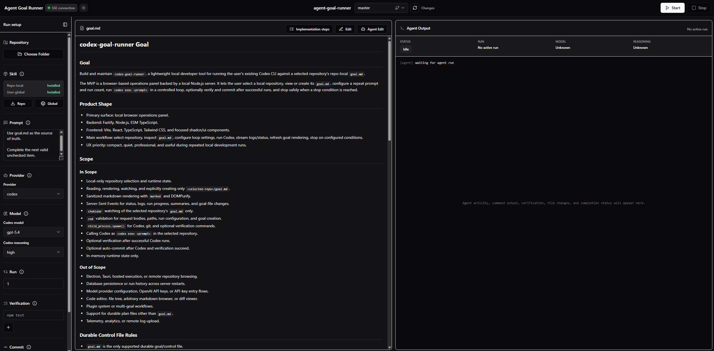

# agent-goal-runner

Run long agent coding tasks as a controlled series of fresh, goal-driven local CLI passes. This runs with your current codex or claude subscription, or with local models through the Pi harness.

`agent-goal-runner` is a local browser app for developers who use `goal.md` to steer agent work. It starts a localhost server, lets you select a local Git repository, shows the current goal file, and runs repeatable Codex, Claude, or Pi CLI passes with live logs, progress, summaries, optional verification commands, and optional Git commits.



The app is local-first. It does not host your repository, proxy agent requests through a service, or manage provider authentication. Agent runs execute in the repository you select on your machine and use your local filesystem, local Git, and locally installed agent CLIs.

## What It Does

- Select a local Git repository and inspect or create its `goal.md`.
- Run Codex, Claude, or Pi CLI passes from that repository with a consistent prompt and run count.
- Stream logs, run status, progress, and final summaries into a local UI.
- Re-read `goal.md` between passes and stop on completion, blocked state, errors, or user stop.
- Run optional verification commands after successful passes.
- Optionally commit successful changes with generated commit messages.
- Install the bundled `goal-runner-framework` skill globally or into the selected repository.
- Manage local branches for the selected repository.

## Requirements

- Node.js 20 or newer
- npm
- Git available on `PATH`
- Codex CLI installed and authenticated for Codex runs
- Claude CLI installed and authenticated only if you use the Claude provider
- Pi harness installed and available on `PATH` only if you use the Pi provider for local-model runs

Codex CLI authentication is handled by the Codex CLI itself. Sign in with Codex from a terminal before using Codex runs in this app. Claude and Pi setup are also handled by their local CLIs. For Pi runs, leave the Pi model empty to use the harness default or enter a local model name to pass as `--model`. `agent-goal-runner` does not store provider credentials or perform provider authentication.

## Run With npx

Start the local app with:

```sh
npx agent-goal-runner
```

Then open:

```text
http://127.0.0.1:4317
```

By default the server binds to `127.0.0.1` on port `4317`. Override those values with `HOST` and `PORT` if needed:

```sh
HOST=127.0.0.1 PORT=4320 npx agent-goal-runner
```

On Windows PowerShell:

```powershell
$env:PORT = "4320"
npx agent-goal-runner
```

## Development From Source

Clone the repository, install dependencies, and start the development servers:

```sh
git clone https://github.com/Scott-Bauman/agent-goal-runner.git
cd agent-goal-runner
npm install
npm run dev
```

Development mode runs the Fastify backend and Vite frontend together. The backend listens on `http://127.0.0.1:4317`, and Vite prints the frontend URL, usually `http://127.0.0.1:5173`.

To run the built app from a clone:

```sh
npm run build
npm start
```

The built backend serves both the API and the built frontend from `http://127.0.0.1:4317`.

For source changes, validate the project with:

```sh
npm run typecheck
npm run lint
npm test
npm run build
npm pack --dry-run
```

## Bundled Goal Skill

The package includes a bundled `goal-runner-framework` skill. The skill helps Codex create and maintain `goal.md` files in the structure expected by this app.

You can install it from the UI after selecting a repository, or from a source checkout:

```sh
npm run install:skill:global
npm run install:skill:repo -- "C:\path\to\target-repo"
```

Global install copies the skill to your user-level `.agents/skills` directory. Repo-local install copies it into the selected repository under `.agents/skills`, which is often the most reliable option when switching between repositories.

## Documentation

- [Development guide](docs/DEVELOPMENT.md)
- [Troubleshooting](docs/TROUBLESHOOTING.md)

## License

MIT. See [LICENSE](LICENSE).
